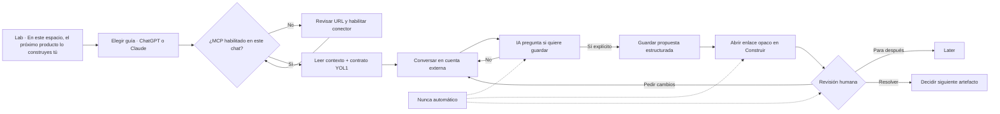

# Builder — mapa visual canónico v0.2

**Estado:** piloto compartido revisable.
**Autoridad:** `DIRECCION-PRODUCTOS-FELIPE.md`.
**Regla:** ninguna flecha representa sincronización de conversación, publicación o integración financiera real.

## Qué significa cada límite

| Límite | Copy visible | Evidencia exigida para avanzar |
|---|---|---|
| MCP piloto | `Piloto disponible` | URL HTTPS, tools/list, lectura y escritura explícita verificadas |
| Chat externo | `YOL1 no lee ni sincroniza tu conversación` | ninguna; el prompt funciona manualmente |
| Handoff | `Sólo lo que tú decidas guardar` | confirmación explícita antes de la herramienta de escritura |
| Guardado MCP | `En borrador` | ID opaco, enlace, expiración y confirmación del backend |
| Guardado manual | `Borrador local de este navegador` | identificador local y opción de borrar |
| Revisión | `No publica ni cambia el core` | decisión humana trazable |

## Vacío, error y reversa

| Momento | Vacío/error esperado | Recuperación honesta |
|---|---|---|
| No aparece MCP en el cliente | conector no habilitado en el chat | revisar la configuración y abrir un chat nuevo |
| Falla guardar compartido | no afirmar `guardado` | conservar la propuesta en el chat y reintentar después |
| Falla copiar al portapapeles | no afirmar `copiado` | seleccionar/copiar el texto manualmente |
| No hay resumen todavía | formulario opcional vacío | guardar propósito + fit o volver al chat |
| Faltan campos obligatorios | validación del formulario | completar nombre, título, propósito y fit |
| Se guardó algo incorrecto | borrador compartido visible | no publicar; pedir una nueva versión hasta implementar borrado autenticado |
| Revisión pide cambios | propuesta sigue siendo borrador | volver al chat y crear una nueva versión |

## Señales de confianza

- `Manual`: la persona decide qué sale de su chat.
- `Local`: el prototipo guarda en este navegador, no en una bandeja compartida.
- `Compartido`: el MCP guarda sólo el resumen estructurado y devuelve un enlace opaco con expiración.
- `Por validar`: una presencia técnica no acredita compatibilidad ni seguridad.
- `Humano`: ninguna aprobación editorial se delega a IA o MCP.
