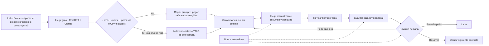

# Builder — mapa visual canónico v0.1

**Estado:** artefacto local revisable.  
**Autoridad:** `DIRECCION-PRODUCTOS-FELIPE.md`.  
**Regla:** ninguna flecha representa sincronización, publicación o integración real.

## Qué significa cada límite

| Límite | Copy visible | Evidencia exigida para avanzar |
|---|---|---|
| MCP no validado | `Integración MCP por validar` | prueba por cliente, URL, auth y scopes |
| Chat externo | `YOL1 no lee ni sincroniza tu conversación` | ninguna; el prompt funciona manualmente |
| Handoff | `Sólo lo que tú decidas incorporar` | acción explícita de copiar/completar |
| Guardado | `Borrador local de este navegador` | identificador local y opción de borrar |
| Revisión | `No publica ni cambia el core` | decisión humana trazable |

## Vacío, error y reversa

| Momento | Vacío/error esperado | Recuperación honesta |
|---|---|---|
| No aparece MCP en el cliente | compatibilidad no confirmada | continuar con prompt y referencias manuales |
| No existe URL validada | control deshabilitado | no instalar URL de ejemplo |
| Falla copiar al portapapeles | no afirmar `copiado` | seleccionar/copiar el texto manualmente |
| No hay resumen todavía | formulario opcional vacío | guardar propósito + fit o volver al chat |
| Faltan campos obligatorios | validación del formulario | completar nombre, título, propósito y fit |
| Se guardó algo incorrecto | borrador local visible | borrar inmediatamente ese borrador |
| Revisión pide cambios | propuesta sigue siendo borrador | volver al chat y crear una nueva versión |

## Señales de confianza

- `Manual`: la persona decide qué sale de su chat.
- `Local`: el prototipo guarda en este navegador, no en una bandeja compartida.
- `Por validar`: una presencia técnica no acredita compatibilidad ni seguridad.
- `Humano`: ninguna aprobación editorial se delega a IA o MCP.
